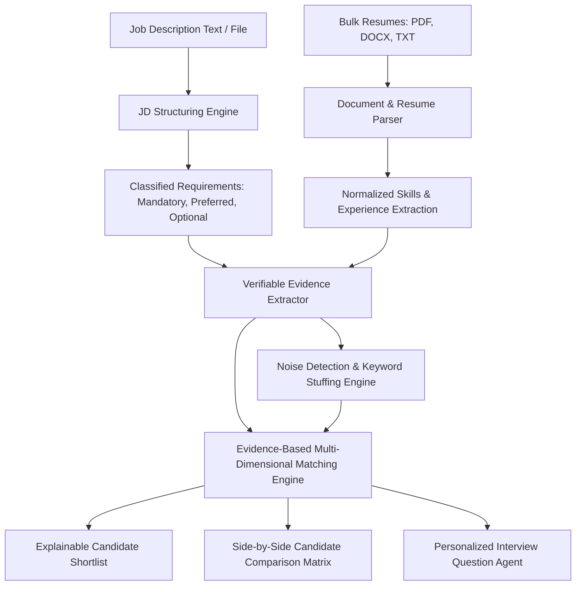

# RecruitIQ — AI Recruitment Intelligence Platform

**RecruitIQ** is an explainable, evidence-backed recruitment intelligence platform designed to replace superficial keyword counting with verified production evidence, noise detection, multi-candidate comparison, and tailored interview guides.

---

## 🏛️ 1. Architecture & Tech Stack



### **Frontend Stack**
- **Framework**: Next.js 16 (App Router) + TypeScript
- **Styling**: Tailwind CSS (Executive dark/light palette with glassmorphism badges)
- **Icons**: Lucide React
- **Key Modules**:
  - `/` — **Dashboard**: Real-time pipeline metrics, recent jobs, and processed candidates.
  - `/jobs/create` — **Create Job**: Live JD parser with 3-tier requirement classification preview.
  - `/resumes/upload` — **Upload Resumes**: Bulk upload with SHA-256 duplicate detection & progress bars.
  - `/candidates` — **Candidate Pool**: Searchable candidate table with multi-select comparison.
  - `/candidates/[id]` — **10-Section Candidate Profile**: Candidate Overview, Match Summary, Requirement Analysis, Evidence, Experience, Projects, Skills, Missing Requirements, Uncertain Claims, and Noise Telemetry.
  - `/candidates/compare` — **Multi-Candidate Comparison Matrix**: Side-by-side evaluation grid across all criteria.
  - `/shortlist` — **Explainable Shortlist**: Multi-dimensional scoring cards, 7-dimension filters, and "Why this score?" modal.
  - `/interview-questions` — **Personalized Interview Agent**: 5-category interview guides with interviewer briefings.
  - `/benchmark` — **Candidate A vs B Benchmark**: Live interactive proof that *More Keywords ≠ Better Candidate*.

### **Backend Stack**
- **Framework**: Python 3.14 + FastAPI
- **Database**: PostgreSQL / SQLite Pure-Python Repository Pattern
- **Parsers & Agents**:
  - `DocumentParser`: High-res PDF, DOCX, and TXT text extraction
  - `JobDescriptionParser`: 10-field extraction + 3-tier classification (MANDATORY, PREFERRED, OPTIONAL)
  - `SkillNormalizer`: Canonical taxonomy resolution with protected distinction (`Java != JavaScript`, `C++ != C#`)
  - `EvidenceExtractor`: 9-tier evidence strength scoring engine with verbatim sentence citations
  - `NoiseDetector`: Keyword stuffing, repetition, unsupported claims, and JD copy-paste detection
  - `MatchingEngine`: Multi-dimensional evidence-weighted scoring algorithm
  - `InterviewAgent`: Personalized 5-category technical & behavioral interview guide synthesizer

---

## ⚙️ 2. Environment Variables & Setup

### **Environment Variables**
Create `.env` inside `frontend/` (optional for defaults):
```env
NEXT_PUBLIC_API_URL=http://localhost:8000
```

Create `.env` inside `backend/` (optional for defaults):
```env
DATABASE_URL=sqlite:///./recruitiq.db
API_V1_STR=/api/v1
DISABLE_SQLALCHEMY_CEXT=1
```

---

### **Local Setup Instructions**

#### **1. Backend (Python + FastAPI)**
```bash
cd backend
# Create and activate virtual environment
python -m venv venv
# On Windows:
.\venv\Scripts\activate
# On Linux/macOS:
source venv/bin/activate

# Install dependencies
pip install fastapi uvicorn pydantic python-docx pypdf requests

# Launch the FastAPI Server
python -m uvicorn app.main:app --host 127.0.0.1 --port 8000 --reload
```
API Documentation will be live at `http://127.0.0.1:8000/docs`.

#### **2. Frontend (Next.js + TypeScript)**
```bash
cd frontend
npm install
npm run dev
```
Open `http://localhost:3000` in your web browser.

---

## 🧠 3. End-to-End AI Pipeline

```
Job Description ──► JD Analysis ──► Bulk Resume Parsing ──► Skill Normalization
                                                                    │
Interview Questions ◄── Explainable Shortlist ◄── Matching Engine ◄── Evidence Extraction
                                                        ▲                  │
                                                        └──── Noise Engine ◄
```

1. **Job Description Structuring**: Extracts job title, required/preferred experience, technical stack, certifications, and classifies every requirement as `MANDATORY`, `PREFERRED`, or `OPTIONAL`.
2. **Resume Parsing & Entity Extraction**: Parses candidate contact info, employment timelines, calculated durations, responsibilities, projects, and original verbatim text.
3. **Skill Normalization**: Maps thousands of raw terms to canonical taxonomy keys (`Python 3` / `Python programming` → `Python`, `ML` → `Machine Learning`) with guarded distinctions.
4. **Verifiable Evidence Extraction**: Scans work history and project sentences for every JD requirement, ranking evidence across 9 tiers (from *Mere mention: 1.0* to *Leadership/ownership: 10.0*).
5. **Noise Detection & Stuffing Telemetry**: Measures the ratio of unbacked keywords to evidence-backed sentences, flags JD copy-pasting, and applies noise penalties.
6. **Multi-Dimensional Matching Engine**: Weighs mandatory coverage, relevant experience, verified evidence strength, depth, and recency while penalizing noise and uncertainty.
7. **Explainable Shortlist & Comparison Matrix**: Provides a row-by-row comparative matrix and *"Why this candidate received this score"* rationales.
8. **Personalized Interview Agent**: Synthesizes a 5-category interview guide (Technical, Project, Experience, Skill Verification, Clarification) with expected signals and red flags.

---

## 📊 4. Matching Methodology & Core Philosophy

### **The Golden Rule**:
$$\text{MORE KEYWORDS} \neq \text{BETTER CANDIDATE}$$
$$\text{STRONGER EVIDENCE} + \text{VERIFIED EXPERIENCE} = \text{HIGHER RANK}$$

### **Scoring Weights Formula**:
$$\text{Final Score} = w_m \cdot M + w_e \cdot E + w_v \cdot V + w_d \cdot D + w_r \cdot R + w_p \cdot P - \text{NoisePenalty} - \text{UncertaintyPenalty}$$

- **Mandatory Requirements ($M$)**: 35% weight
- **Relevant Experience ($E$)**: 20% weight (calculated from verified employment dates)
- **Evidence Strength ($V$)**: 15% weight (based on exact quote depth)
- **Skill Depth ($D$)**: 10% weight
- **Recency ($R$)**: 10% weight
- **Preferred Requirements ($P$)**: 10% weight
- **Noise Penalty**: Up to $-20\%$ for keyword stuffing & copy-pasting
- **Uncertainty Penalty**: Up to $-10\%$ for ambiguous / list-only claims

### **Zero-Hallucination Policy**:
If evidence is absent from the resume text, RecruitIQ outputs:
> *"Evidence not found in resume."*
Status is marked `MISSING` with explanation: *"Requirement was not found in the resume. (Does not assume lack of skill)"*.

---

## 📡 5. Complete REST API Endpoints

| Method | Endpoint | Description |
|---|---|---|
| `POST` | `/jobs` | Create a job posting and analyze/structure JD |
| `GET` | `/jobs` | List all active job postings with resume counts |
| `GET` | `/jobs/{job_id}` | Retrieve single job with structured parsed requirements |
| `POST` | `/jobs/{job_id}/resumes` | Bulk upload resumes (PDF, DOCX, TXT) with SHA-256 duplicate detection |
| `GET` | `/jobs/{job_id}/resumes` | List all candidate resumes linked to a job |
| `GET` | `/resumes/{resume_id}` | Get candidate details with parsed entities and original text |
| `GET` | `/resumes/{resume_id}/evidence` | Extract verifiable evidence against job requirements |
| `POST` | `/skills/normalize` | Normalize raw skill strings to canonical entities |
| `POST` | `/analyze-jd` | Analyze raw JD text and return structured JSON |
| `GET` | `/jobs/{job_id}/candidates/{resume_id}/match` | Get candidate match score breakdown & noise telemetry |
| `GET` | `/resumes/{resume_id}/match` | Get standalone candidate match score & explainability |
| `GET` | `/jobs/{job_id}/matches` | Ranked candidate shortlist ordered by evidence |
| `POST` | `/candidates/compare` | Multi-candidate side-by-side requirement matrix |
| `GET` | `/demo/comparison` | Candidate A (stuffed) vs Candidate B (evidence) benchmark |
| `GET` | `/resumes/{resume_id}/interview-questions` | Personalized 5-category interview guide |
| `GET` | `/stats/dashboard` | Real-time platform metrics and activity feeds |
| `GET` | `/health` | API Healthcheck |

---

## 🧪 6. Automated Testing & Verification

### **1. Run Full Phase 6 Resilience & 10-Candidate Test Suite**
```bash
python backend/test_phase6_resilience.py
```
This tests:
- 404 missing resume handling
- Empty JD handling
- Ingestion of all 10 synthetic candidate archetypes
- Duplicate resume detection
- Corrupted PDF handling
- Critical rule verification (Elena & Viktor outrank Kevin Buzzword)
- Personalized Interview Question Agent generation

### **2. Run Matching Engine & Candidate A vs B Test Suite**
```bash
python backend/test_flow.py
```

### **3. Run Frontend Production Typecheck & Build**
```bash
cd frontend
npm run build
```
Generates clean production builds across all 12 application routes.

---

## 👥 10 Synthetic Candidate Profiles Included

1. **Candidate 1** (`candidate_01_strong_evidence.txt`): Elena Rostova — Staff Engineer with 6+ years verified Python, FastAPI, Docker, AWS handling 28K req/sec.
2. **Candidate 2** (`candidate_02_keyword_stuffed.txt`): Kevin Buzzword — Repeats Python 30+ times, only 2-month internship.
3. **Candidate 3** (`candidate_03_transferable_experience.txt`): Marcus Vance — Senior Go/C++ distributed systems engineer with strong systems depth.
4. **Candidate 4** (`candidate_04_missing_mandatory.txt`): Chloe Simmons — Senior Frontend React engineer with zero Python/backend data experience.
5. **Candidate 5** (`candidate_05_outdated_experience.txt`): Arthur Pendleton — Outdated Python 2.7 / Django 1.4 experience from 2012.
6. **Candidate 6** (`candidate_06_project_only.txt`): Samantha Chen — Berkeley CS graduate with impressive FastAPI/LLM projects but 0 enterprise employment.
7. **Candidate 7** (`candidate_07_uncertain_claims.txt`): Jordan Blake — Vague bullet points and ambiguous scale.
8. **Candidate 8** (`candidate_08_copied_jd.txt`): Derek Plagiar — Copied lines verbatim from Job Description text.
9. **Candidate 9** (`candidate_09_concise_expert.txt`): Viktor Kravchenko — Concise expert with fewer keywords but 8 years of high-volume payment processing ($40M daily).
10. **Candidate 10** (`candidate_10_broad_shallow.txt`): Nathan Generalist — Lists 30+ technologies with shallow exposure to each.
